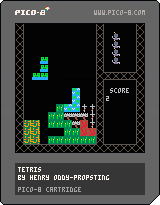

# Pico8 Carts

I made some [Pico8](https://www.lexaloffle.com/pico-8.php) games a few 
years ago. The Pico8 is a "fantasy console" made by Lexaloffle. It is a 
[Lua](www.lua.org) based integrated development environment for 8-bit style games with tight 
constraints. The games can be published as "raw" .p8 files, packaged 
.p8.png files, a html page, and an executable. 

## Tetris

I made this game as part of a 24-hour hackday. I started from knowing 
absolutely no Lua, to a finished and working game.

Tetris takes advantage of the tile-based map on the Pico8. The only 
active sprites are the currently moving piece, and the next piece in the 
box. A gravity timer decreases every 1/60th of a second, when it reaches 
zero the tiles below the active sprite are checked. If any are occupied 
then the map tiles are set to the appropriate sprite and then the map 
is checked for complete lines. Otherwise it moves the sprite down one 
map tile.

In order to check the map it will loop from top to bottom checking for 
full rows and adds them to a list. Once it has finished it clears the 
map tile contents of each full row. Then for each row removed it will 
shift the entire contents of the map above down one row.

The game checks for game-over when it moves the piece down. If the piece 
can not move down, and one of the map tiles it is over is full, then it 
will game-over. It will not game-over if it goes above the top of the 
map.
